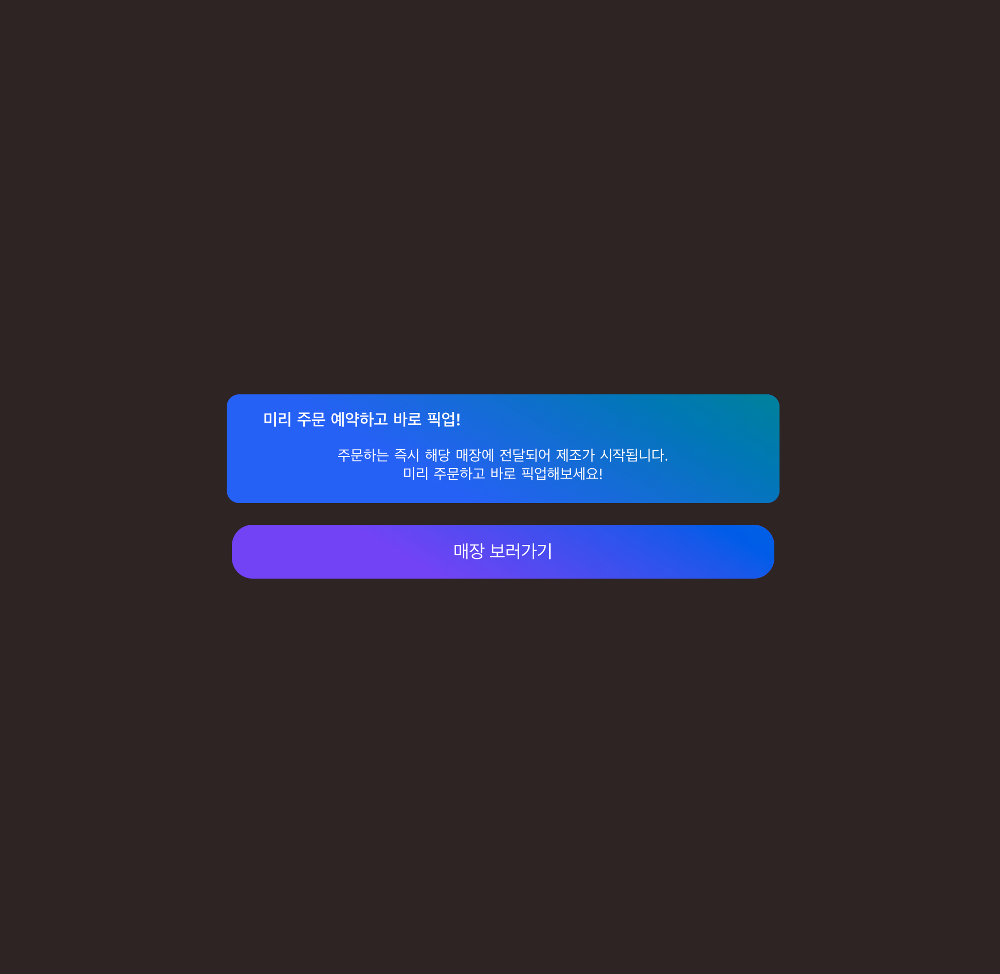
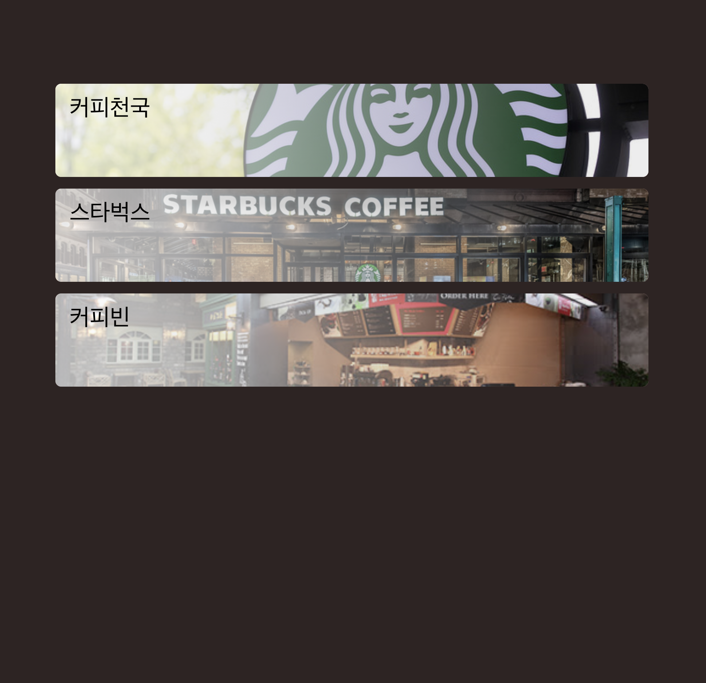
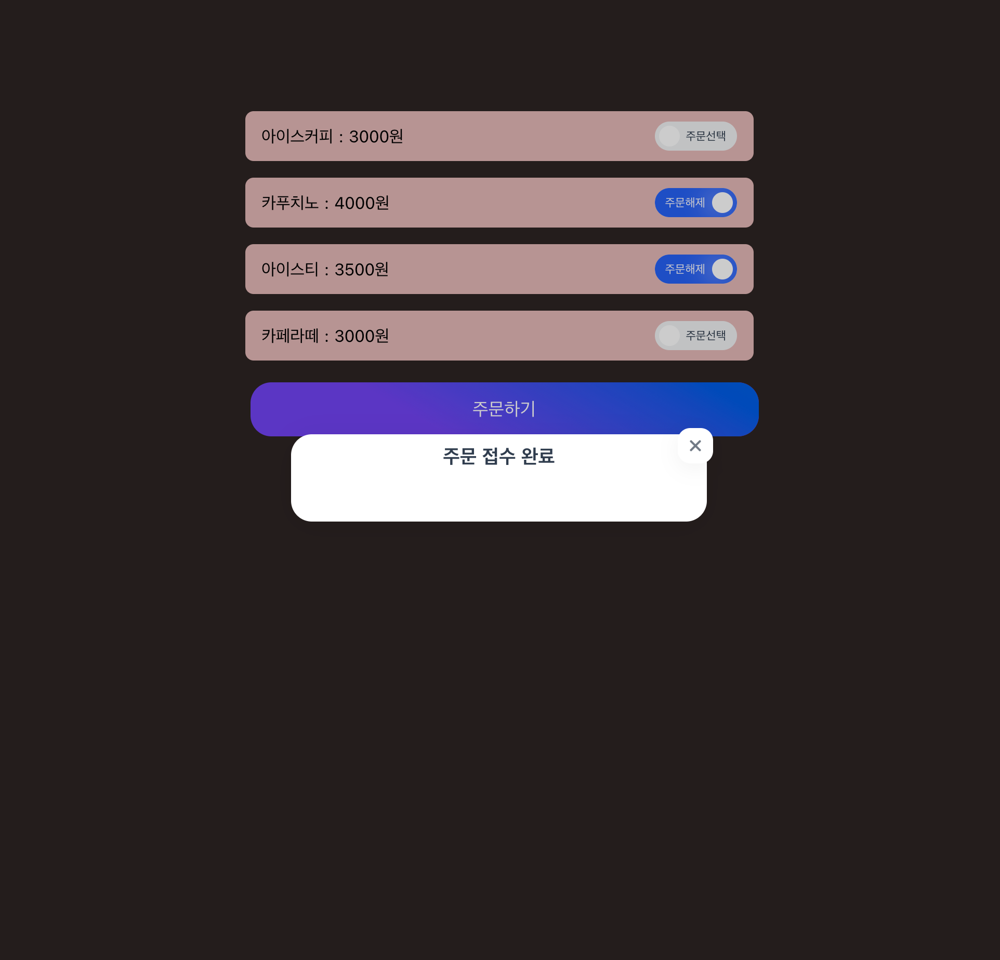
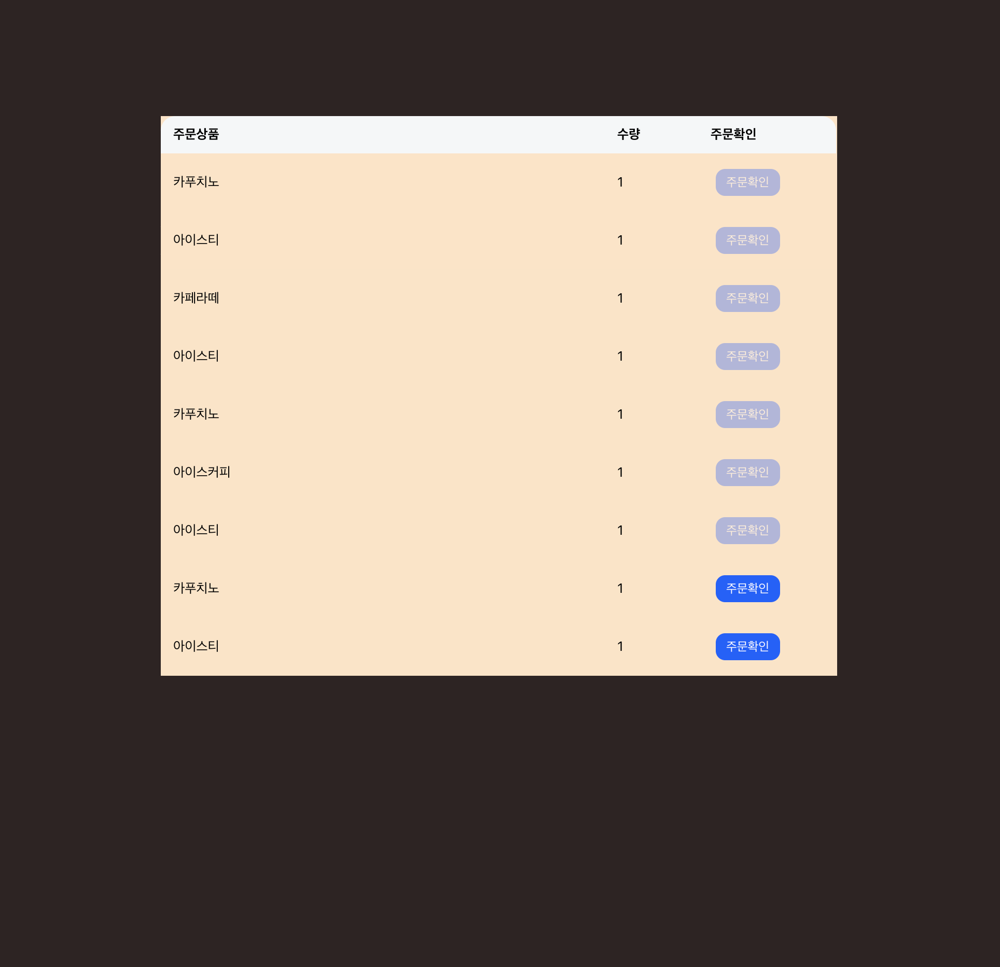
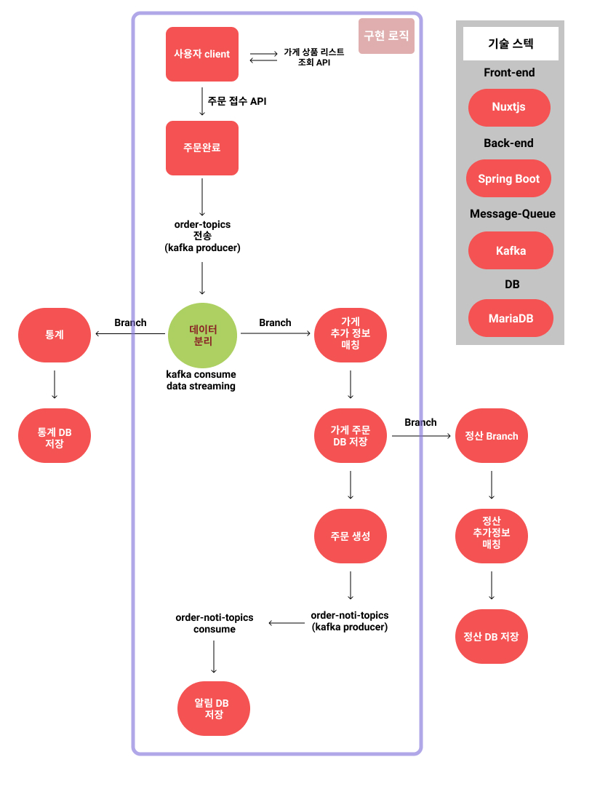

# Front end 
```
$ cd nuxtjs-order-client
$ yarn install # node_modules install
$ yarn dev # client server start
```

## Front Client 페이지 캡처
### 메인 화면("/")

### 스토어 리스트("/store-list")

### 상품 리스트("/product/:_storeId/list")

### 매장 주문 확인 페이지("/order/:_storeId/order-list")



# server architecture

